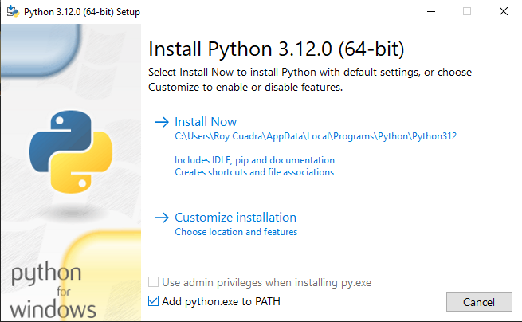
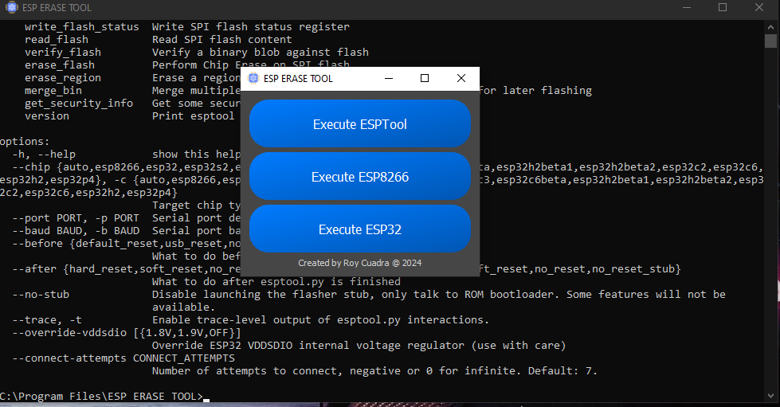

# ESP Erase Tool

I created this Python-based software to simplify the process of erasing flash content on the ESP8266 and ESP32. With this tool, you can easily erase flash memory without needing to touch the command prompt! 😎

## Installation

You can download the installer from [GitHub Releases](https://github.com/roycuadra/ESP-ERASE-TOOL-/releases/tag/v1.1).

- Before Installing Python make sure to check the Add python.exe to PATH

## Acknowledgments

Thanks to **Espressif Systems** for providing the ESP-IDF and ESPTool, which make this program possible by allowing seamless access to command-line tools for managing ESP devices.
